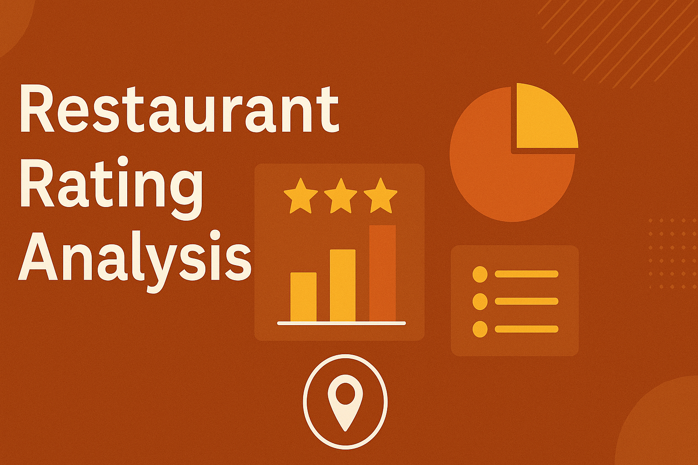
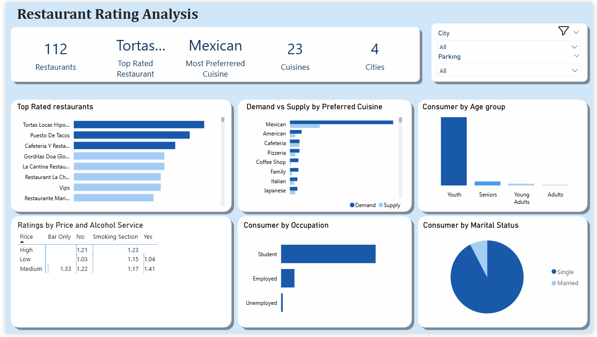

# Restaurant_Rating_Analysis

## Project Overview

This project analyzes a restaurant rating dataset from a 2012 customer satisfaction survey conducted in Mexico. The goal is to extract actionable insights for Business entrepreneurs and Investors.

Dataset: Provided by Digitaley Drive.

## Objectives
- Uncover the traits of high-performing restaurants
- Analyze consumer preferences and demographics
- Identify gaps in market demand and supply
- Recommend investment opportunities based on performance metrics
  

## Metrics
- Total Restaurants
- Top Rated Restaurants
- Total Cuisine
- Most Preferred Cuisine
- Average Rating

## Skills Demonstrated
- Data cleaning  (Power Query)
- Data querying, transformation, analysis  (SQL Server)
- Modeling, Dax Measures, Visualization  (PowerBI)

## Data Preparation
- Cleaned nulls and standardized rating values
- Merged rating fields into a composite score (average of overall, food, and service ratings)
- Created DAX measures to show key metrics
- Transformed demographic & preference columns for easier querying in SQL

## Visualization

You can Interact with the Dashboard [HERE](Capstone_2.pbix)

## Analysis & Findings

### High-Rated Restaurants:

- Found in San Luis Potosi zone
- Have parking available

### Consumer Preferences:

- Consumer preference for certain cuisines (e.g., Mexican, Italian) aligned with higher ratings.

### Consumer Demographics:

- Majority of respondents are in the Youth Age group, Students by Occupation and Single by Marital Status

### Demand–Supply Gaps:

- Medium price level receive good ratings but are underserved
- Certain cuisines like Japanese and Italian had high consumer interest but few available restaurants.
- Restaurants with medium prices, parking availability, and alcohol service tended to score high, this restaurants can be invested on.

## Recommendations

- Target high-performing zones like San Luis Potosi
- Invest in cuisines with high ratings but low supply
- Ensure restaurants offer parking and alcohol service to boost ratings

  

